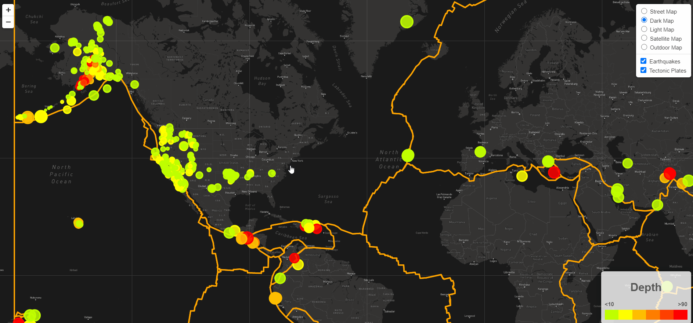

# Leaflet-challenge

## Background
The Purpose of this project is to build an [interactive map](https://jamess2eagle.github.io/leaflet-challenge/) where the user can change the base layers and also add/remove overlay layers by using past 7 days of earthquake data from [USGS API](https://earthquake.usgs.gov/earthquakes/feed/v1.0/geojson.php) and tectonic plates data in JSON format from [Github Pages](https://github.com/fraxen/tectonicplates).  The USGS API gets updated every five minutes and has various earthquake data properties, but the main properties that will be used in this projects are latitude, longitude, magnitude, depth and location.

The website with an interactive map was built by using **html**, **css** and **js** along with several js libraries.  **D3** library was used to analyze the JSON objects from API.  **Leaflet** and **mapbox** libraries were used to plot the interactive map..

## Preview

